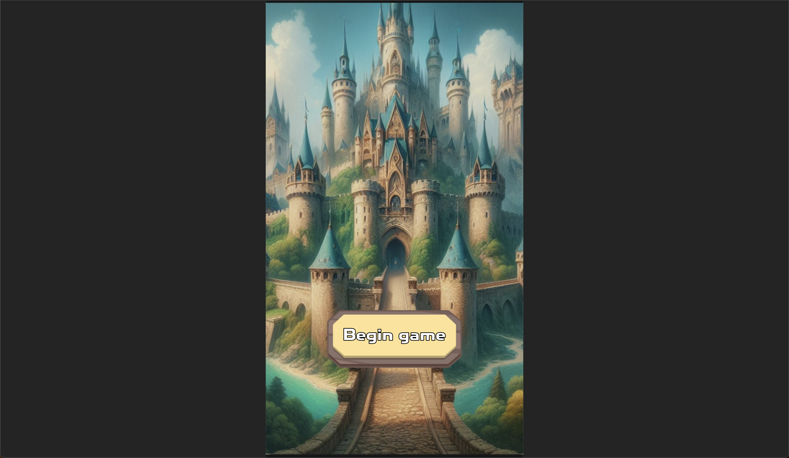

# Техническое задание игры 3 в ряд
## 1. Введение
   ### 1.1. Цель проекта
Сверстать интерфейс сайта и написать логику на JS. Сайт представляет
из себя игру модифицирвованную игру 3 в ряд.
   ### 1.2. Платформы (браузеры, мобильные устройства)
Десктоп и мобильные устройства. 
Верстка одна с соотношением сторон 10:16.
На десктопе в горизонтальной ориентации паддинги слева и справа черным цветом.
На мобильных устройствах в вертикальной ориентации паддинги сверху и снизу.
Если выборе 100% по высоте приложение не влезает (из-за соблюдения соотношения сторон),
выбирать 100% по ширине.

Пример паддингов на десктопе (к внешнему виду игры отношения не имеет).

## 2. Общее описание игры
### 2.1. Концепция и жанр
3 в ряд с прокачкой и убийством монтстров.
### 2.2. Основные механики
Игрок должен выставлять кристаллы в ряд по 3 и более штук (совпадение). Каждое успешное совпадение наносит
урон монстру. Совпадения полученные подряд (комбо) дают больше очков. При успешном совпадении,
кристаллы удаляются, поле сдвигается, при сдвиге могут образоваться новые совпадения. Так получаются комбо.
После того как все совпадения от сдвига поля обработаются в образовавшуюся пустоту сверху добавляются
новые кристаллы.

## 3. Игровой процесс
### 3.1. Механика "3 в ряд"
Игровое поле 9 в ширину и 8 в высоту. Элементы поля - кристаллы.
Есть обычные кристаллы, есть суперкристаллы. У каждого обычного кристалла есть тип. 
Одновременно на поле находится не более 5 типов обычных кристаллов и любые суперкристаллы. \
Можно менять местами. Если больше 3 кристаллов одинакового типа выстраиваются в ряд - 
они удаются с поля, пустота заполняется сдвигом имеющихся сверху кристаллами на одну клетку 
с последующей генерацией новых кристаллов в самом верхнем освободившемся ряду. 
#### Боссы
В отличие от монстров боссы имеют ограниченное количество времени на убийство.
### 3.2. Система уровней
Уровни делятся на главы - каждая глава содержит 10 уровней, 9 из них со случайным
монстром и последний с монстром-боссом.
При каждом совпадении из монстра вычитается соответствующее 
количество очков (наносится урон). Комбо увеличивают наносимый урон.
Когда монстр погибает, игрок переходит на следующий уровень.
В игре циклично сменяются биомы: \
Лес - паук, клещ, гоблин-разбойник, \
Снежные горы - йети, злой снеговик, ледяной слизень,  \
Океан - морской еж, медуза, водяной элементаль, краб, \
Пустыня - скорпион, большой змей, какой-нибудь черный жук, \
Пещера - живой минерал-кристалл, призрак-шахтер, робот-копатель, \
Подземный замок - дракон, огнедышащий робот, голем, темный рыцарь, мимик \
Огненное подземелье - чертик, лавовый слизень, ифрит, лавовый голем \

### 3.3. Система прокачки персонажа/предметов
У игрока есть параметры:
Атака - увеличение урона, наносимому монстру за каждый разрушенный кристалл. 
Например, если игрок разрушил 3 кристалла и его урон = 1, монстр получит 3 урона.
Если урон игрока 5, то монстр получает 3 * 5 = 15 урона. 
Урон прокачивается покупкой предметов в магазине. 
### 3.4. Способности.
Всего в игре есть 4 способности и сброс поля, которые сами применяются без действий игрока.
Как только способность готова, она автоматически подсвечивается ареолом в интер-
фейсе. И при следующем взаимодействии с полем способность попытается примениться.
1. Огненный шар - простой усиленный динамит. Нажимаешь в любом месте поля и он его взрывает. 
2. Огненное дыхание - любой мэтч взрывает весь столбец при вертикальном метче 
и строчку при горизонтальном
3. 2х золото - все заработанное золото увеличивается в 2 раза на 5 секунд. Перезарядка 60 секунд
### 3.5 Суперкристаллы
При выставлении 4 кристаллов в вертикальный ряд появляется вертикальный 
суперкристалл. При любой перестановки с соседом он уничтожает весь
столбец в котором он оказался (даже без успешного совпадения). Аналогично с горизонтальным
кристаллом - уничтожает всю строчку.
### 3.6 Магазин предметов
После каждого приобретения предмета цена увеличивается на +40%, а
бонус на +30% (то есть его можно приобрести повторно).
В игре есть магазин предметов, в котором есть следующие позиции:
1. (Стартовые параметры: +1 урон, цена 10 кристаллов) Деревянная палка. wooden-stick.png
2. (Стартовые параметры: +5 урона, цена 50 кристаллов) Лук новичка. novice-bow.png
3. (Стартовые параметры: +25 урона, цена 250 кристаллов) Ржавый меч. rust-sword.png
4. (Стартовые параметры: +170 урона, цена 2500 кристаллов) Меч солдата soldier-sword.png
5. (Стартовые параметры: +850 урона, цена 12500 кристаллов) Лук городского стража guard-bow.png
6. (Стартовые параметры: +4250 урона, цена 62500 кристаллов) Посох приключенца adventurer-staff.png
7. (Стартовые параметры: +28300 урона, цена 625000 кристаллов) Чугунная пушка canon.png
8. (Стартовые параметры: +141500 урона, цена 3125000 кристаллов) Королевский меч royal-sword.png
9. (Стартовые параметры: +707500 урона, цена 15620000 кристаллов) Посох дракона dragon-staff.png
10. (Стартовые параметры: +4719000 урона, цена 156200000 кристаллов) Мифриловый меч mithril-sword.png
11. (Стартовые параметры: +23595000 урона, цена 781000000 кристаллов) Голем-прислужник golem-minion.png
12. (Стартовые параметры: +117975000 урона, цена 3905000000 кристаллов) Древнее заклинание ancient-spell.png
### 3.7 Магазин героев
Герои увеличивают урони игрока в секунду.
После каждого приобретения предмета цена увеличивается на +40%, а 
бонус на +30% (то есть его можно приобрести повторно).
1. (Стартовые параметры: +1 урон в секунду, цена 100 кристаллов) Новичок-приключенец newbie-hero.png
2. (Стартовые параметры: +5 урона в секунду цена 500 кристаллов) Лучник из деревки village-archer.png
3. (Стартовые параметры: +25 урона в секунду цена 2500 кристаллов) Бойцовый пес war-dog.png
4. (Стартовые параметры: +167 урона в секунду цена 25000 кристаллов) Командир отряда commander.png
3. (Стартовые параметры: +835 урона в секунду цена 125000 кристаллов) Арбалетчик crossbowman.png
4. (Стартовые параметры: +4175 урона в секунду цена 625000 кристаллов) Огненный маг fire-mage.png
### 3.8 Магазин пассивок

### 3.9 Валюта
### 3.10 Пассивный заработок
Игрок может зарабатывать валюту, пока он не играет. Заработок формируется по формуле:

Время убийства монстра = ((Жизни монстра на самом последнем открытым игроком уровне) / (пассивный урон игрока) \
Убито монстров = округление до целого вниз((Время вне игры) / (время убийства монстра)) \
Заработок = (Убито монстров) * (награда за убийство монстра на самом последнем открытым игроком уровне)

## 4. Интерфейс пользователя
### 4.1
### 4.1. Главный экран
### 4.2. Игровое поле
### 4.3. Магазин предметов (согласно макету)
### 4.4. Меню настроек
### 4.5. Экран результатов уровня

## 5. Графика и анимация
### 5.1. Стиль оформления (мультяшный, яркий)
Можно взять из готовых спрайтов 
### 5.2. Требования к спрайтам и иконкам
### 5.3. Анимации игровых элементов
### 5.4. Спецэффекты

## 6. Звуковое оформление
### 6.1. Музыкальное сопровождение
### 6.2. Звуковые эффекты

## 7. Система прогресса и экономика
### 7.1. Валюта игры (кристаллы)
### 7.2. Система прокачки предметов
### 7.3. Условия открытия новых уровней/предметов

## 8. Технические требования
### 8.1. Используемые технологии (HTML5, JavaScript, CSS3)
### 8.2. Оптимизация для мобильных устройств
### 8.3. Требования к производительности

## 9. Монетизация
### 9.1. Модель монетизации (free-to-play с внутриигровыми покупками)
### 9.2. Система внутриигровых покупок

## 10. Локализация
### 10.1. Поддерживаемые языки (русский + другие по необходимости)

## 11. Тестирование
### 11.1. Требования к тестированию
### 11.2. Критерии приемки

## 12. Сроки и этапы разработки
### 12.1. Основные вехи проекта
### 12.2. Сроки сдачи промежуточных и финальной версий

## 13. Приложения
### 13.1. Макеты интерфейсов
### 13.2. Описание игровых предметов и их свойств
### 13.3. Балансировка игровой экономики

